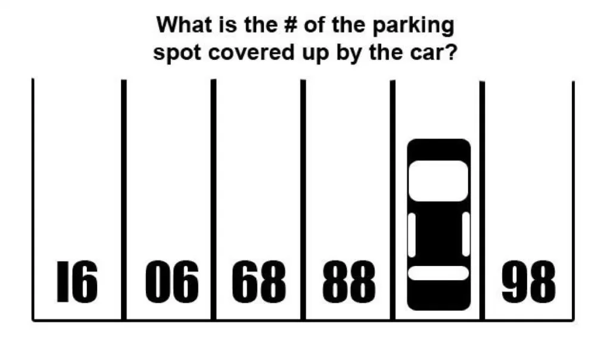
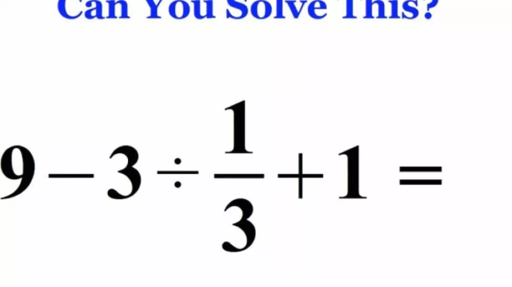
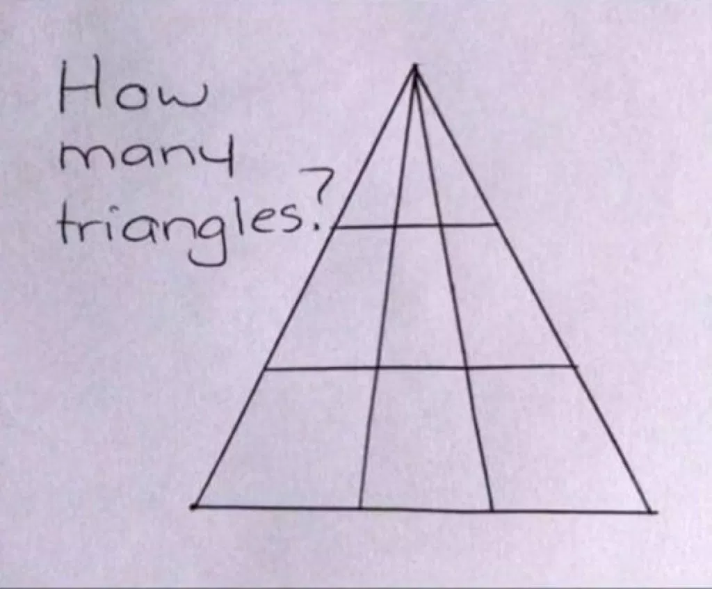
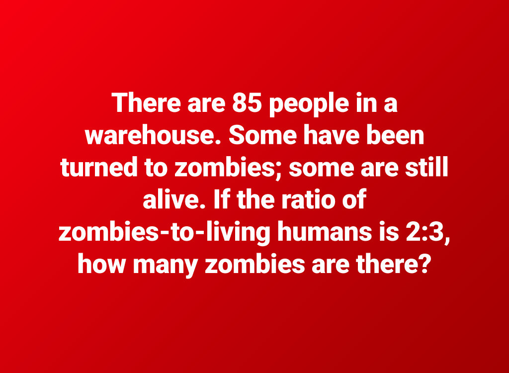
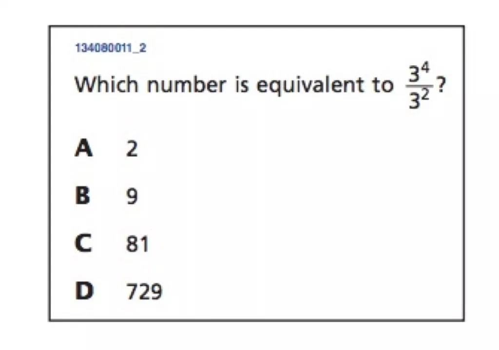
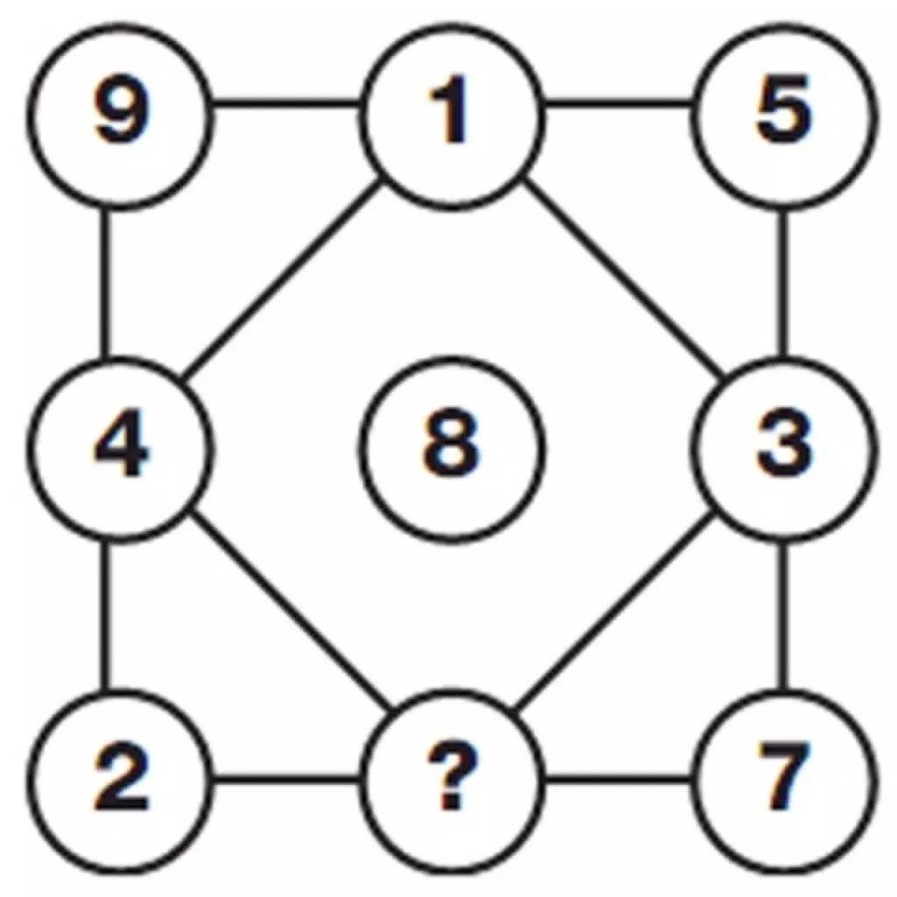
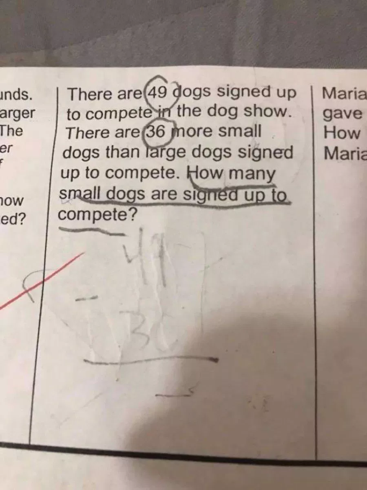
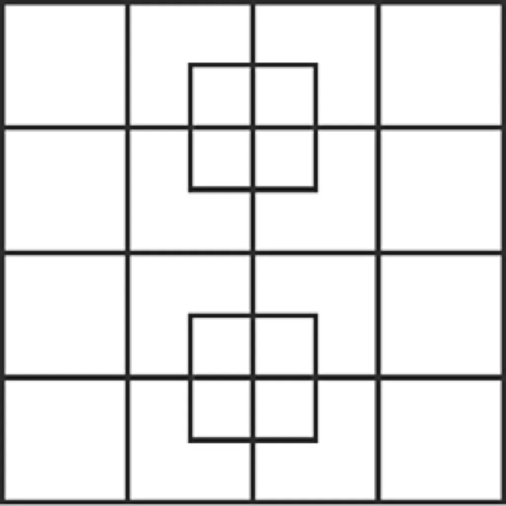

# Questions

1. Using only 4 straight lines, cut a pizza into 11 pieces (the pieces don't
   have to be the same size.

2. What is the number of the parking space covered by the car?
   

3. What's the result of this calculation?
   

4. 

5. 

6. 

7. 

8. 

9. 

10. You need 7 gallons of water, but you only have two jugs with which to
    measure: a 5-gallon jug and a 3-gallon jug. How do you measure the 7
    gallons?

1. My lodger told me that an Icosahedron has 20 sides. That got me thinking
   about other 3D shapes. Match the name of the shape with the number of faces
   it has:

   * Names: Dodecahedron, Octahedron, Tetrahedron, Cube
   * Faces: 6, 8, 4, 12

2. I went into Adele's Takeaway over the road and asked how much a large
   vegetarian pizza is. He said, 'It's half its price plus 6 quid mate.' How
   much is the pizza?

3. Every day the area of the garden covered by weeds doubles. By the 10th day
   the entire garden is covered. What fraction of the garden is covered on day
   9?

4. You're a 7th level wizard being attacked by a dragon. You roll 2 six-sided
   dice, and you slay it if you throw a double six. What's the probability of
   slaying the dragon?

5. You decide the odds aren't good, and so you try to run away. You roll 2
   six-sided dice and you escape if the total is 11 or more. What's the
   probabiliy that you escape?

6. The combination lock to our shed has 3 wheels, and each wheel has numbers
   0 to 4. How many combinations are there?

7. Is 7 a prime number?

8. If you randomly chose an answer to this question, what's the chance of
   getting it right?

   * a) 0%
   * b) 25%
   * c) 75%
   * d) 100%

9. I'm looking at a book on the bookshelf. It's the 3rd from the right, and the
   6th from the left. How many books on the bookshelf?

10. Why is a circular manhole cover better than an oblong one?
